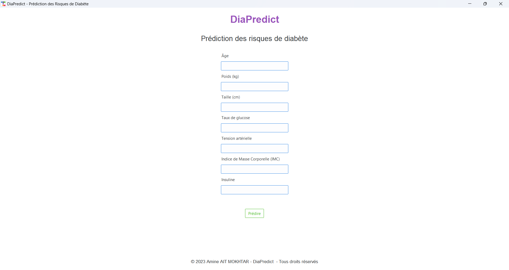

# DiaPredict - Modèle Prédictif pour le Diabète


## Description du projet

**DiaPredict** est un projet de modèle prédictif pour évaluer les risques de diabète. Après avoir suivi une formation en intelligence artificielle, j'ai appliqué mes connaissances en développant ce modèle qui utilise plusieurs algorithmes de machine learning pour prédire la probabilité d'une personne de développer le diabète en fonction de différents paramètres médicaux.

L'interface utilisateur est conçue avec **Tkinter**, offrant une présentation simple et intuitive des résultats de prédiction.

## Objectifs

- Mettre en place un modèle de machine learning capable de prédire le risque de diabète en fonction de données médicales.
- Créer une interface utilisateur conviviale pour faciliter l'interaction avec l'utilisateur.
- Tester et comparer différents algorithmes d'apprentissage automatique afin de trouver celui qui offre les meilleures performances.

## Algorithmes de machine learning utilisés

Les algorithmes suivants ont été utilisés dans le cadre du projet :

- **SVM (Support Vector Machine)**
- **Decision Tree**
- **Random Forest**

Ces modèles ont été testés et évalués pour déterminer leur performance dans la prédiction des risques de diabète.

## Technologies et bibliothèques

Le projet fait appel à plusieurs bibliothèques et outils, notamment :

- **Pandas** : Utilisé pour la manipulation et l'analyse des données.
- **NumPy** : Utilisé pour les calculs scientifiques et la gestion des tableaux multidimensionnels.
- **Matplotlib** : Utilisé pour visualiser les données et les résultats sous forme de graphiques.
- **Tkinter** : Utilisé pour concevoir une interface utilisateur graphique permettant aux utilisateurs de saisir des données et de recevoir les prédictions du modèle.

## Fonctionnalités de l'interface utilisateur

L'interface utilisateur développée avec **Tkinter** permet aux utilisateurs de :

- Entrer des informations médicales telles que l'âge, le poids, la taille, le taux de glucose, la tension artérielle, l'indice de masse corporelle (IMC), et le niveau d'insuline.
- Obtenir une prédiction des risques de diabète en fonction des données saisies.
- Visualiser les résultats de manière simple et accessible.

## Installation et exécution

### Prérequis

- Python 3.x
- Bibliothèques Python : pandas, numpy, matplotlib, tkinter

### Installation des dépendances

Utilisez la commande suivante pour installer les bibliothèques requises :

```bash
pip install pandas numpy matplotlib
